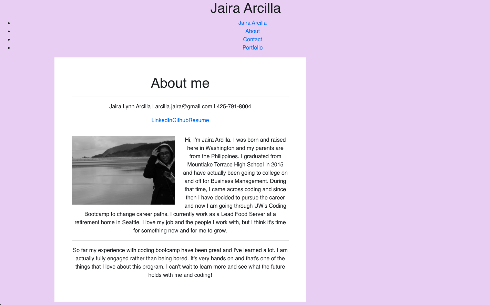
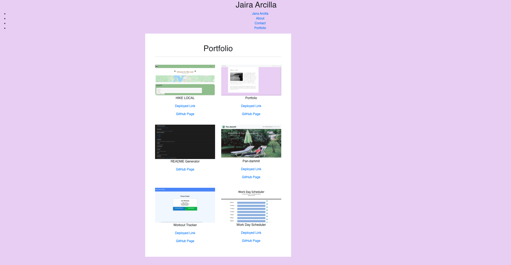
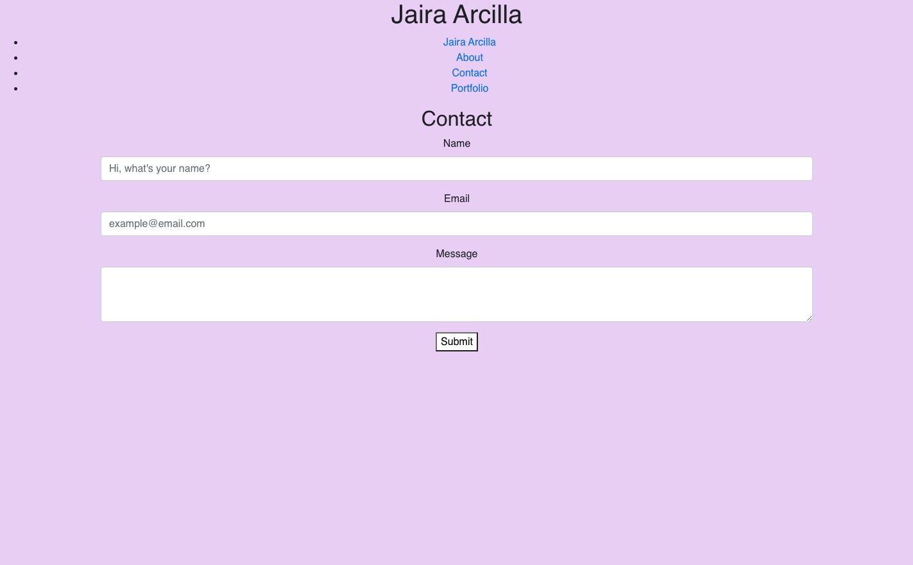

# React Portfolio

Deployed Link: https://jairalynn.github.io/react-portfolio/

## Instructions

* [Updated Portfolio](#updated-portfolio)

* [Design](#design)

* [React](#react)

* [Updated LinkedIn Profile](#updated-linkedin-profile)

#### Design

As with the previous portfolio homework, "good" design is subjective. Your site should look
"polished." Here are a few guidelines on what that means:

* Mobile-first design

* Choose a color palette for your site so it doesn't just look like the default bootstrap theme or an unstyled HTML site.

* Make sure the font size is large enough to read, and that the colors don't cause eye strain.

* If you want to go above and beyond, try using animations and react component libraries. Note 
that this will _not_ affect your grade, but it may impact how potentials employers gauge your knowledge.

### Updated Portfolio

Your updated site should still have all of the content it previously had:

* Your name

* Links to your GitHub profile & LinkedIn page as well as your email address and phone number

* A link to a PDF of your resume with updated projects

* A list of projects. For each project, make sure you have the following:

  * Project title

  * Link to the deployed version

  * Link to the GitHub repository

## Questions

My email is arcilla.jaira@gmail.com and my Github is jairalynn